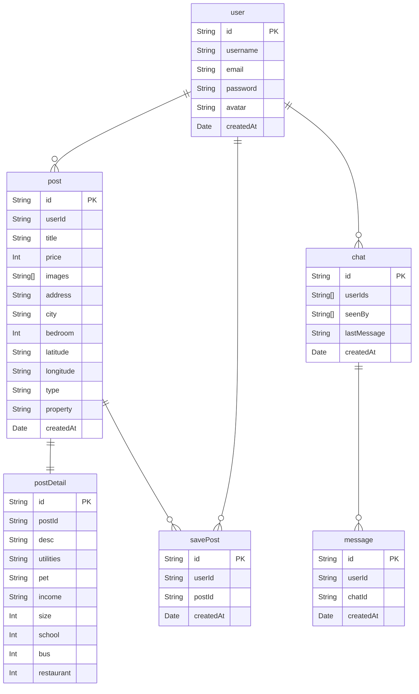
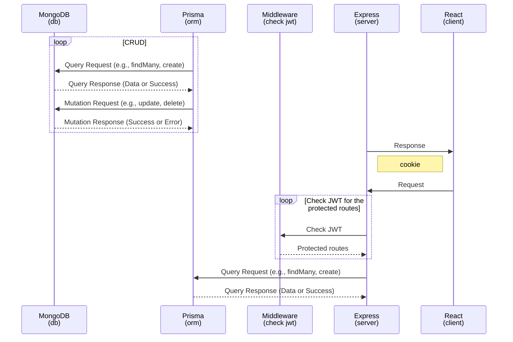

# Description

Full stack training

## Tech Stack

Express, React, Prisma, MongoDB, Javascript

## Structure

```bash
root
├── api
│   ├── controller
│   ├── lib
│   ├── middleware
│   ├── prisma
│   └── routes
└──　client
    ├── public
    └── src
```

## Development

### Setup

#### Server

```bash
$ cd api
```

and `console-ninja node --watch app.js` or `nodemon app.js`

```bash
$ node app.js
```

or

```bash
$ nodemon app.js
```

or

```bash
$ console-ninja node --watch app.js
```

---

#### Client

```bash
$ npm run dev
```

or

```bash
$ yarn dev
```

---

### ERD



### Sequence


