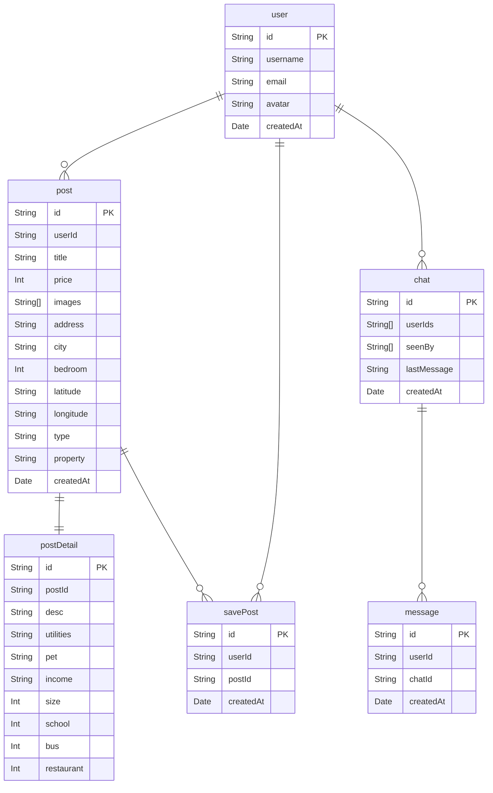

# Description

Full stack practice

## Structure

```bash
project-root
├── api
└──　client
```

## Development

### Setup

#### Server

```bash
$ cd api
```

and `console-ninja node --watch app.js` or `nodemon app.js`

```bash
$ node app.js
```

```bash
$ nodemon app.js
```

```bash
$ console-ninja node --watch app.js
```

---

### ERD


